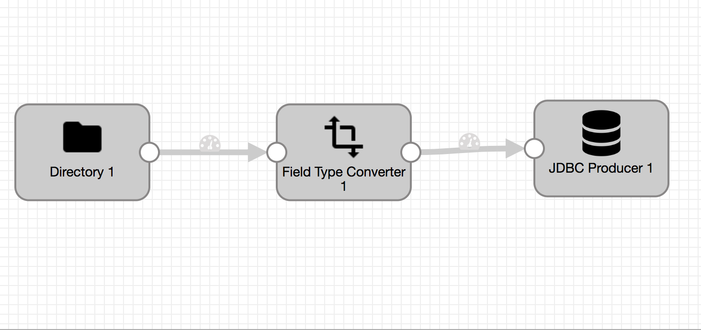

LocalDir ==> DataTypeConversion ==> JDBCProducer


# Table schema:
```
create table flights
(Year mediumint ,
Month mediumint ,
DayofMonth mediumint ,
DayOfWeek mediumint ,
DepTime mediumint ,
CRSDepTime mediumint ,
ArrTime mediumint ,
CRSArrTime mediumint ,
UniqueCarrier varchar(255) ,
FlightNum mediumint ,
TailNum varchar(255) ,
ActualElapsedTime mediumint ,
CRSElapsedTime mediumint ,
AirTime varchar(255) ,
ArrDelay mediumint ,
DepDelay mediumint ,
Origin varchar(255) ,
Dest varchar(255) ,
Distance mediumint ,
TaxiIn varchar(255) ,
TaxiOut varchar(255) ,
Cancelled mediumint ,
CancellationCode varchar(255) ,
Diverted mediumint ,
CarrierDelay varchar(255) ,
WeatherDelay varchar(255) ,
NASDelay varchar(255) ,
SecurityDelay varchar(255) ,
LateAircraftDelay varchar(255),
id mediumint(8) unsigned NOT NULL auto_increment,
PRIMARY KEY (id)) AUTO_INCREMENT=1;
```
# Test Data: 
wget http://stat-computing.org/dataexpo/2009/1987.csv.bz2


